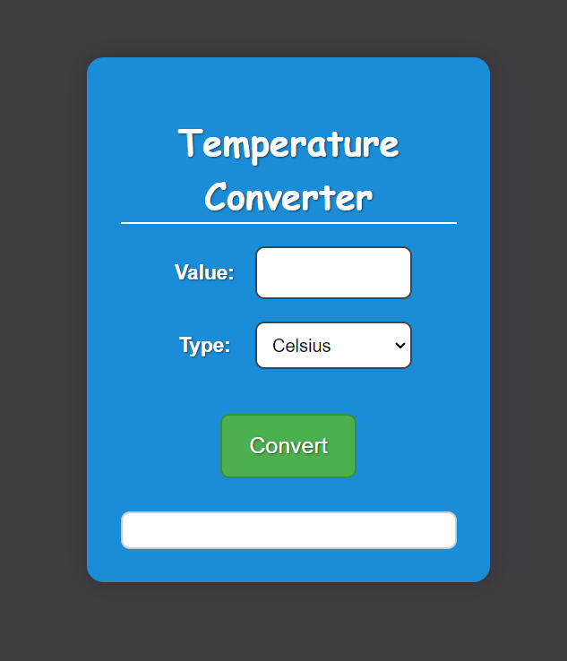

<h2>LEVEL 1</h2>

<h3>Task 1: Landing Page</h3>

Created a landing Page for Chandrashekhar Architects PVT LTD

Displaying screenshots of the 3 sections including header and footer

 

<h3>Task 2: Portfolio</h3>

Layout

Displaying screenshots of the 3 sections and the footer

 

<h3>Task 3: Temperature Converter</h3>

Layout

Conversion

 
